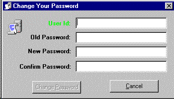



## Smart Form Navigation Ver: 1\.0

### Description

This is time not to talk much, but the screen shot will give you much more idea about this posting.

As you get an idea from the Title itself, yes its really smart FORM, somewhat I could say intelligent form for the navigation.

Auto Navigation is the motive of this small program.

 I hope you would like this idea.

This code could be useful for your application to give a professional touch and make it more sophisticated and user-friendly

Infect its a part of Code of my running project.

Thanks for your feeback...
 
### More Info
 

             |
---                |---
**Submitted On**   |2003-06-13 13:14:12
**By**             |[Deepak Kumar Shaw](https://github.com/Planet-Source-Code/PSCIndex/blob/master/ByAuthor/deepak-kumar-shaw.md)
**Level**          |Intermediate
**User Rating**    |5.0 (10 globes from 2 users)
**Compatibility**  |VB 4\.0 \(16\-bit\), VB 4\.0 \(32\-bit\), VB 5\.0, VB 6\.0
**Category**       |[Files/ File Controls/ Input/ Output](https://github.com/Planet-Source-Code/PSCIndex/blob/master/ByCategory/files-file-controls-input-output__1-3.md)
**World**          |[Visual Basic](https://github.com/Planet-Source-Code/PSCIndex/blob/master/ByWorld/visual-basic.md)
**Archive File**   |[Smart\_Form1600326132003\.zip](https://github.com/Planet-Source-Code/deepak-kumar-shaw-smart-form-navigation-ver-1-0__1-46146/archive/master.zip)

